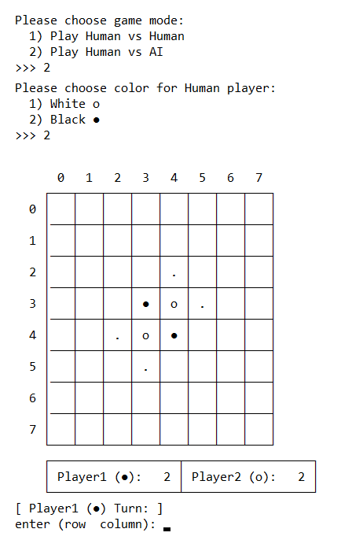

# Reversi (Othello) game
Implementation of Reversi console game in Python with an AI player that is developed by Minimax algorithm.

## About Reversi
There are sixty-four identical game pieces called disks, which are light on one side and dark on the other. Players take turns placing disks on the board with their assigned color facing up. During a play, any disks of the opponent's color that are in a straight line and bounded by the disk just placed and another disk of the current player's color are turned over to the current player's color. The objective of the game is to have the majority of disks turned to display one's color when the last playable empty square is filled [[Wiki](https://en.wikipedia.org/wiki/Reversi)].

  

## Project structure
- ### 📂 directory [reversi_game]
    - #### 📄 file [base_reversi.py]
      This file contains `Reversi` class which is a model that implements all functionalities needed for the game independent of the user interface.
  
    - #### 📄 file [player.py]
      This file contains `Player` _abstract_ class which is the base class for any player in the game. 

    - #### 📄 file [player_ai.py]
      This file contains `AIPlayer` class that is inherited from `Player` class. It uses the **Minimax** algorithm to provide an action for the player. 

    - #### 📄 file [player_human.py]
      This file contains `HumanPlayer` class that is inherited from `Player` class. It uses console interface and asks for an action.

    - #### 📄 file [reversi_console.py]
      This file contains `ReversiConsoleUI` class which uses player classes and `Reversi` class to implement a console-based reversi game. This class controls the flow of the game and asks players for action. 

- ### 📄 file [main.py]
  This file is the starting point of game. This will start console game by asking for the mode of game and the color of the human player:

  

